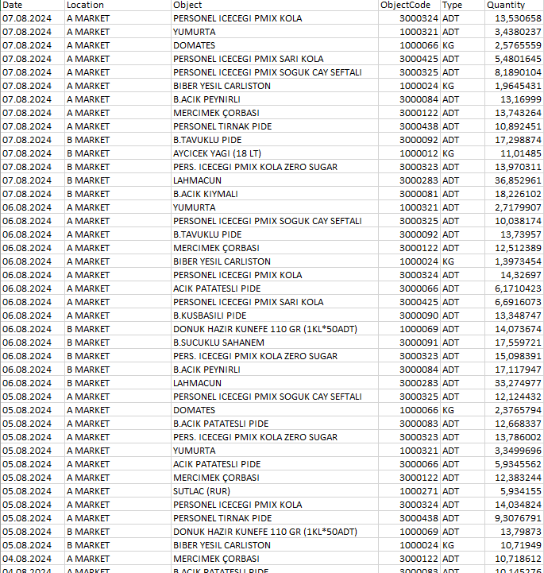

# Product Quantity Forecasting with Random Forest

This Python script implements a forecasting model to predict product quantities using a Random Forest machine learning model. The entire process involves data preparation, model training, evaluation, and forecasting future quantities. Below is a comprehensive overview of the script's functionality.

## 1. Data Loading and Preparation

- **Load Dataset**: The script begins by loading data from an Excel file located at `C:\Input_Data.xlsx`. This dataset contains historical records of product quantities, dates, locations, and types.

- **Data Conversion**: The 'Date' column is converted from a string format to a datetime format to facilitate time-based analysis. This conversion allows the extraction of additional features.

- **Feature Extraction**: Time-based features are derived from the 'Date' column, including:
  - `DayOfYear`: Day of the year (1-366)
  - `DayOfWeek`: Day of the week (0-6, where Monday=0)
  - `WeekOfYear`: Week number of the year
  - `Month`: Month (1-12)
  - `Year`: Year

**Data Example:**

## 2. Encoding Categorical Variables

- **Label Encoding**: Categorical variables such as `Location` and `Type` are encoded into numeric values. This encoding is necessary for the machine learning model to process these variables effectively.

- **Mapping Creation**: A dictionary is created to map `ProductCode` to `Type`. This mapping helps in associating each product code with its corresponding type during forecasting.

## 3. Defining Features and Target Variable

- **Feature Selection**: Features (X) used in the model include time-based data and encoded categorical variables such as `DayOfYear`, `DayOfWeek`, `WeekOfYear`, `Month`, `Year`, `Location`, `ProductCode`, and `Type`.

- **Target Variable**: The target variable (y) is the quantity of the product that the model aims to predict.

## 4. Splitting Data for Training and Testing

- **Data Split**: The dataset is divided into training and testing sets using an 80-20 split. This separation allows for model training on one subset and evaluation on another.

## 5. Model Training and Hyperparameter Tuning

- **Model Training**: A Random Forest regression model is trained using the training data.

- **Hyperparameter Tuning**: Grid search is utilized to optimize hyperparameters such as the number of trees (`n_estimators`), maximum depth of each tree (`max_depth`), minimum samples required to split a node (`min_samples_split`), and whether to use bootstrap samples (`bootstrap`).

## 6. Evaluating Model Performance

- **Predictions**: The trained model is used to make predictions on the test set.

- **Performance Metric**: The Root Mean Squared Error (RMSE) is calculated to assess the accuracy of the model's predictions.

**Test Results:**

-31July.png)

## 7. Preparing Future Predictions

- **Future Dates**: Future dates are generated to forecast product quantities for the next 7 days.

- **Product Code Distribution**: Historical data is analyzed to understand the distribution of `ProductCode` by day and location. This distribution helps in selecting the most frequent product codes for future forecasting.

## 8. Generating Future Data

- **Future Data Creation**: Data is created for each future date, including product codes and types. The trained model predicts quantities for these future dates.

- **Quantity Prediction**: Predicted quantities are calculated using the trained model, and optional noise is added to simulate variability.

**Predicted Quantities for the Next 7 Days:**

## 9. Finalizing and Saving Results

- **Data Organization**: The results are organized, duplicates are removed.

- **Save to Excel**: The final dataset is sorted by date and location, and then saved to an Excel file at `C:\Forecast.xlsx`.

This script leverages machine learning techniques to forecast future product quantities based on historical data. It enhances planning and decision-making by providing accurate quantity predictions for future dates.

For more details on the implementation, please refer to the `ProjectCode.py` file.
